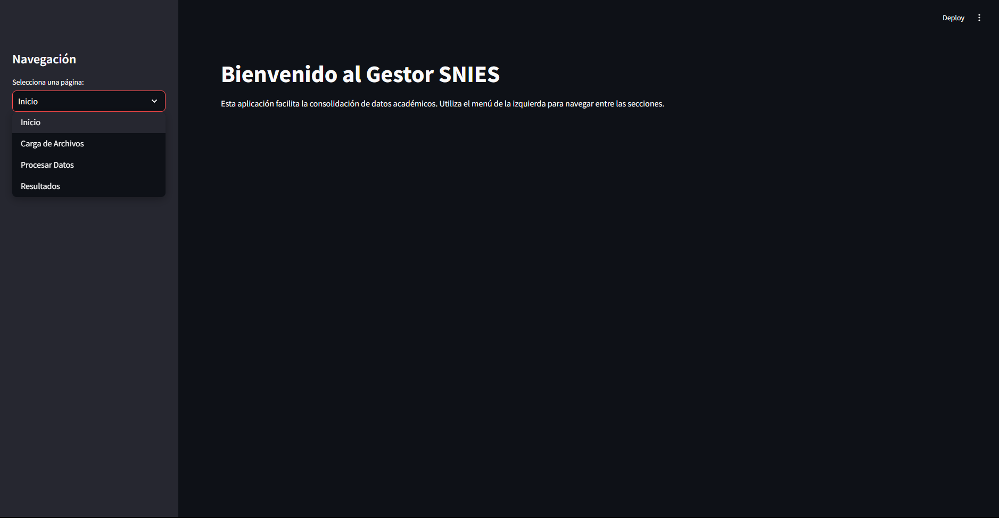
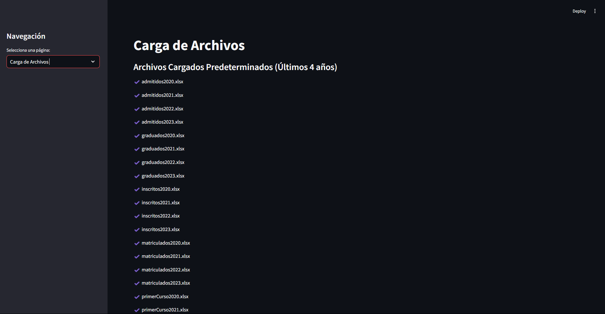
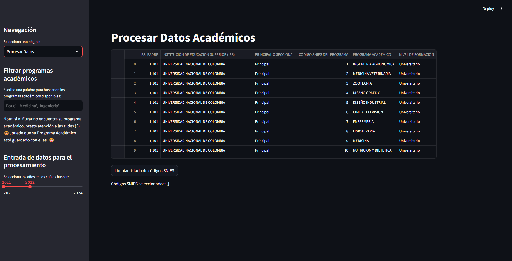
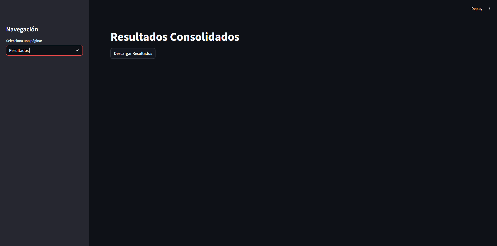

# Manual Técnico - Proyecto SNIES Extractor

## Presentación General

El proyecto **SNIES Extractor** es una herramienta diseñada para gestionar y procesar datos académicos provenientes de archivos de Excel, específicamente para el Sistema Nacional de Información de la Educación Superior (SNIES) de Colombia. La herramienta permite cargar, procesar y exportar información sobre programas académicos, tales como matriculados, admitidos, graduados, y otros atributos, a partir de archivos organizados por año y tipo de dato.

### Objetivo

El objetivo principal de este proyecto es facilitar la carga, procesamiento y exportación de datos académicos, mejorando la eficiencia y reduciendo el riesgo de errores manuales en la gestión de información educativa. Los datos se pueden cargar desde archivos preexistentes o nuevos archivos cargados por los usuarios. Posteriormente, estos datos se procesan y exportan en un archivo consolidado para su análisis.

## Arquitectura del Sistema

El sistema está estructurado en tres componentes principales:

1. **Interfaz de Usuario (Streamlit)**: Una interfaz gráfica donde los usuarios pueden interactuar con el sistema para cargar y procesar los archivos según un filtrado de palabras claves y rango de años e incluso descargar los resultados.




2. **Controlador SNIES**: La capa lógica que maneja las interacciones entre la interfaz de usuario y la lógica de negocio, como la carga de archivos y el procesamiento de los datos.
3. **Gestor de Archivos**: Responsable de leer los archivos de Excel, procesarlos según el tipo de dato y año, y generar un archivo de resultados consolidado.

### Flujo del Sistema

1. **Carga de Archivos**: Los archivos Excel (matriculados, admitidos, graduados, etc.) se cargan a través de la interfaz de usuario, que permite tanto cargar archivos predeterminados como nuevos archivos subidos por el usuario.
2. **Procesamiento de Datos**: Una vez cargados, los archivos se procesan según el tipo de dato (por ejemplo, matriculados, admitidos, etc.). Los datos se organizan por programa académico y año.
3. **Exportación de Resultados**: Después del procesamiento, los resultados se consolidan y se exportan en un archivo Excel que contiene la información procesada para su posterior análisis.

## Componentes Clave

### 1. Interfaz de Usuario (Streamlit)

La interfaz de usuario proporciona una forma interactiva para que los usuarios carguen y procesen los archivos. Utiliza **Streamlit**, una librería para crear aplicaciones web rápidas para proyectos de datos.

#### Funcionalidades Principales:
- **Selección de Archivos**: Permite al usuario subir nuevos archivos para su procesamiento y elegir palabras claves o rango de años para la busqueda de lo requerido.
- **Visualización de Resultados**: Muestra el estado actual de los archivos cargados y procesados.

### 2. Controlador SNIES

El **Controlador SNIES** es el componente central que maneja la lógica del negocio, incluyendo la carga y procesamiento de archivos.

#### Funciones Clave:
- **Cargar Archivos**: Gestiona la carga de archivos desde una ubicación predeterminada o archivos nuevos subidos por el usuario.
- **Procesar Datos**: Lee los archivos, extrae y organiza los datos por programa académico y año, y realiza las operaciones necesarias sobre ellos (por ejemplo, agregar columnas, combinar datos).
- **Generar Resultados**: Consolida los datos procesados y genera un archivo de salida con la información organizada.

### 3. Gestor de Archivos

El **Gestor de Archivos** se encarga de la manipulación y lectura de archivos Excel. Utiliza la librería **Pandas** para manejar los datos y realizar las operaciones de consolidación.

#### Funciones Clave:
- **Leer Archivos**: Lee los archivos Excel y extrae los datos de las columnas relevantes, organizándolos por programa académico y año.
- **Convertir y Limpiar Datos**: Realiza transformaciones de tipo de datos (por ejemplo, convertir columnas a `int64`) y limpia los datos (por ejemplo, separa los datos por sexo).
- **Exportar Archivos**: Consolida todos los datos procesados y los exporta a un archivo Excel.

```mermaid
classDiagram
    class GestorArchivos {
        leer_archivo()
        exportar_archivo()
        convertir_columna_to_int64()
        convertir_columna_sexo()
    }

    class ProgramaAcademico {
        programa_academico
        dict_consolidados
    }

    class SniesController {
        procesar_datos()
        listar_archivos_predeterminados()
        cargar_archivos_nuevos()
    }

    class Menu {
        mostrar_interfaz()
        mostrar_carga_archivos()
        mostrar_inicio()
        procesar_datos()
        obtener_filtrado_de_programas()
        mostrar_resultados()
    }

    SniesController ..> GestorArchivos : Dependencia (lee archivos)
    Menu ..> SniesController : Dependencia (delegar acciones)
    GestorArchivos o-- ProgramaAcademico : Composición (almacena datos)